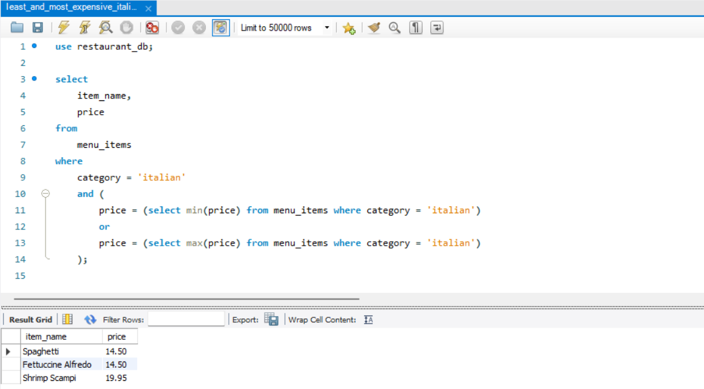
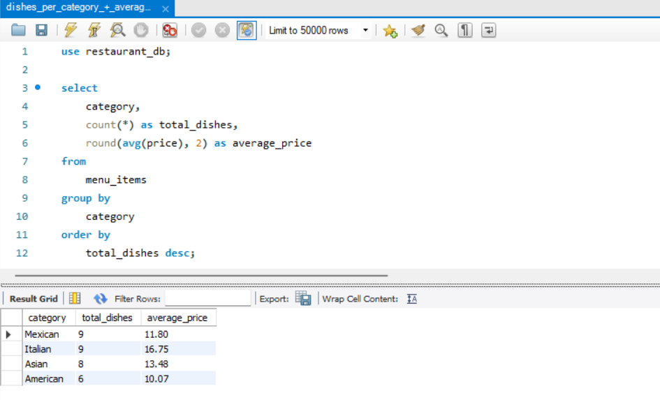
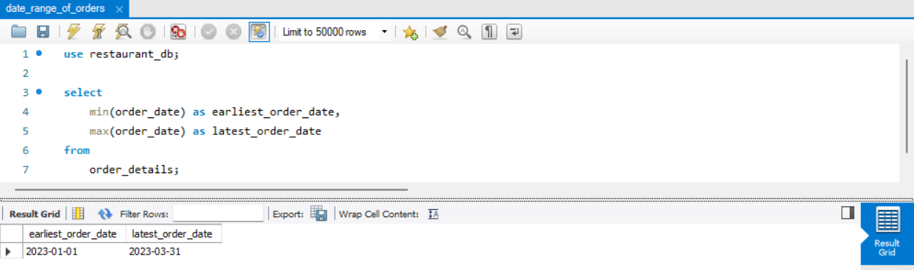
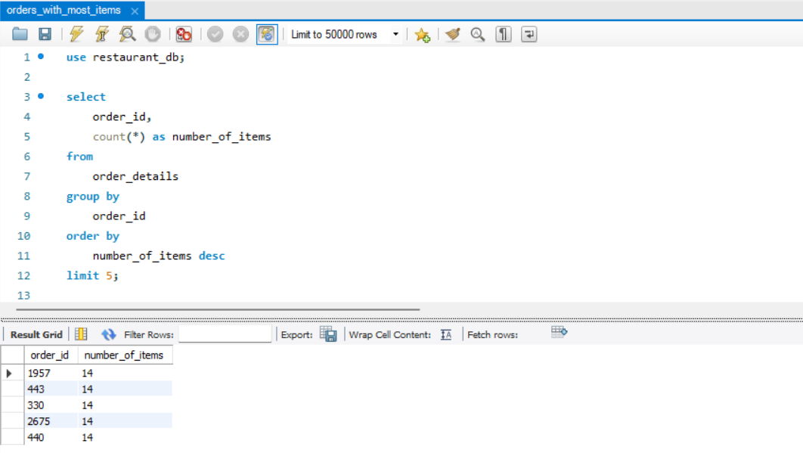
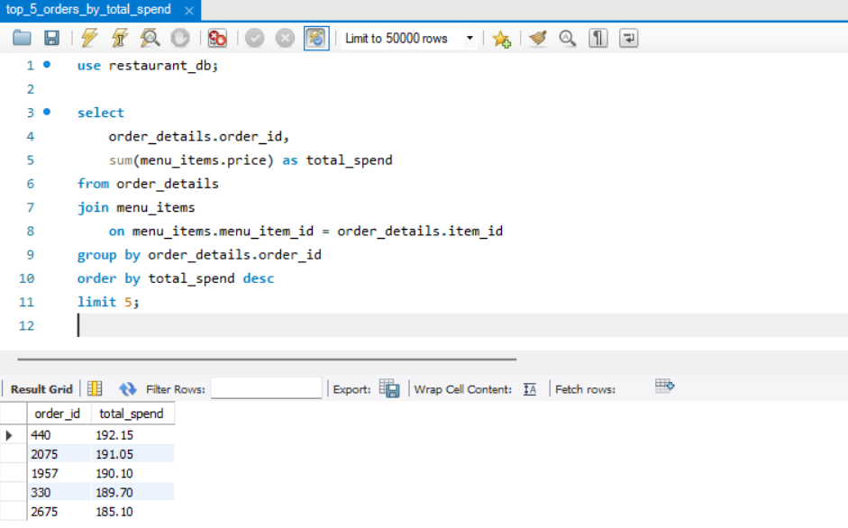
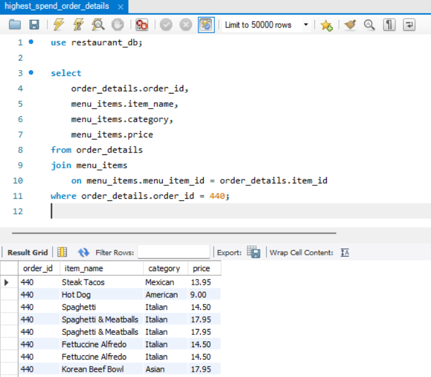

## 📌 Overview
This project analyzes restaurant order data from a fictitious international cuisine restaurant using SQL to uncover trends in menu item popularity, customer behavior, and high-value orders.  
The goal: provide actionable insights to support **data-driven decisions in food & beverage management**, from menu optimization to upselling strategies.

---

## 🎯 Key Findings

### 🍔 Most & Least Ordered Items
- **Most ordered item:** Hamburger (American, Ordered 622 times)  
- **Least ordered item:** Chicken Tacos (Mexican, Ordered 123 times)  
Customer preferences favor **classic American options**, while niche items like Mexican dishes have lower traction, suggesting opportunities for menu optimization or promotional campaigns.

### 🗂️ Category Insights
- **Most ordered category:** American  
- **Least ordered category:** Mexican  
Popular categories indicate **core menu strengths**, while less popular categories highlight areas for targeted marketing or bundled offers.

### 💰 High-Value Orders
- Top 5 orders by total spend:
    - Order ID 440: $192.15  
    - Order ID 2075: $191.50  
    - Order ID 1957: $190.10  
    - Order ID 330: $189.70  
    - Order ID 2675: $185.10  
High-value orders often combine **premium-priced items with popular staples**, revealing key customer behavior patterns.

---

## 🧩 Objective 1 – Explore the `menu_items` Table
- **Method:** SQL queries analyzing menu composition, price distribution, and category breakdown  
- **Key takeaways:**  
    - Total menu items: 32, providing a diverse selection of cuisines  
    - Price range: $5.00 (Edamame) – $19.95 (Shrimp Scampi), allowing both budget-friendly and premium options  
    - Italian dishes: 9 items, most expensive Shrimp Scampi ($19.95), least expensive Spaghetti & Fettuccine Alfredo ($14.50)  
    - Category overview:  
        - Mexican: 9 dishes, avg $11.80  
        - Italian: 9 dishes, avg $16.80  
        - Asian: 8 dishes, avg $13.48  
        - American: 6 dishes, avg $10.07  
    - Most populated category: Italian; Least populated: American  
- **Insights:** Menu structure balances **popular cuisines and premium offerings**, setting the stage for strategic pricing and promotions.

**Visuals:**

  
*Shows the cheapest and most expensive menu items.*

  
*Overview of total dishes and average price per category.*

---

## 🧩 Objective 2 – Explore the `order_details` Table
- **Method:** SQL queries analyzing order volume, item counts, and high-item orders  
- **Key takeaways:**  
    - Dataset covers **Jan 1 – Mar 31, 2023**, a quarter’s worth of orders  
    - Total unique orders: 5,370; total items ordered: 12,234  
    - Orders with most items: 14 items in orders 330, 440, 443, etc.  
    - Large orders (>12 items): 23  
- **Insights:**  
    - Average order contains 2–3 items, reflecting typical customer behavior  
    - Large orders, though rare, contribute disproportionately to revenue and are opportunities for **targeted promotions**

**Visuals:**

  
*Snapshot showing the earliest and latest orders in the dataset.*

  
*Highlights orders containing the highest number of items.*

---

## 🧩 Objective 3 – Analyze Customer Behavior
- **Method:** SQL joins between `menu_items` and `order_details` to assess popularity, spending, and order composition  
- **Key takeaways:**  
    - **Most & least ordered items:** Hamburger (622), Chicken Tacos (123)  
    - **Top 5 orders by total spend:** Order 440 ($192.15), 2075 ($191.50), 1957 ($190.10), 330 ($189.70), 2675 ($185.10)  
    - **Highest spend order (ID 440):** Includes premium items like Spaghetti & Meatballs, Fettuccine Alfredo, Korean Beef Bowl, combined with popular staples  
    - **BONUS:** Top 5 highest spend orders follow similar patterns, combining premium and popular items  
- **Insights:**  
    - High-value orders are diverse and multi-category  
    - Premium dishes drive revenue, highlighting **upselling and bundle opportunities**  
    - Data-driven insights can inform menu design, pricing, and marketing strategies

**Visuals:**

  
*Displays the top 5 orders by total spend.*

  
*Detailed items in the highest spend order (ID 440).*

---

## 🛠️ Skills Demonstrated
- SQL querying: joins, aggregations, group by, having, subqueries  
- Data cleaning & preprocessing  
- Insight extraction & storytelling  
- Revenue and customer behavior analysis  
- Git & GitHub portfolio practices  

---

## 📂 Tools Used
- MySQL (Workbench)  
- Git & GitHub  
- Maven Analytics dataset  

---

## 📑 Dataset Source
Dataset Source: Maven Analytics (Training dataset)

---

## 💾 How to View the Files
The analysis lives in `restaurant_order_analysis.sql`.  
Open in MySQL Workbench or any SQL editor that supports `.sql` files.
